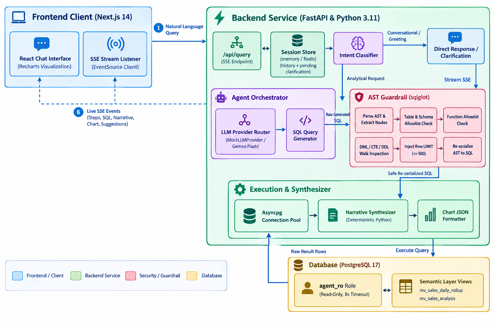
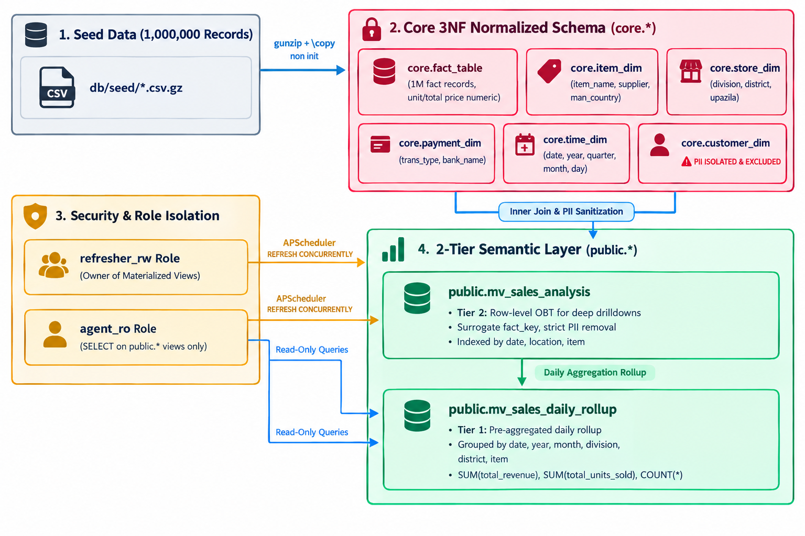

# Retail Agentic Copilot

[](https://github.com/bkget/retail-agentic-copilot/actions/workflows/ci.yml)
[](https://www.python.org/)
[](https://fastapi.tiangolo.com/)
[](https://nextjs.org/)
[](https://www.postgresql.org/)
[](https://www.docker.com/)
[](https://github.com/tobymao/sqlglot)
[](LICENSE)

**Conversational AI analytics copilot over a real 1,000,000-row PostgreSQL retail sales dataset.**  
Ask questions in plain English; a Google ADK / Gemini Flash agent transforms intent into SQL against a hardened 2-tier semantic layer, an independent AST guardrail (`sqlglot`) validates and re-serializes the query before execution, and the result streams back live via Server-Sent Events (SSE) with deterministic narrative calculations and typed visualizations.

> [!NOTE]
> **Built for Real Data Integrity**: Unlike toy demos with synthetic fixtures, this copilot is built and benchmarked against 1,000,000 real retail transaction records. Real data uncovered non-associative float summing errors, regex keyword collisions, and PII leakage risks that synthetic tests ignored. See [What Real Data Caught](#what-real-data-caught).

---

## 📑 Table of Contents

- [Quick Access & Service Endpoints](#quick-access--service-endpoints)
- [Key Features](#key-features)
- [Architecture & Data Flow](#architecture--data-flow)
- [Quickstart with Docker](#quickstart-with-docker)
- [Database Connection & Schema Reference](#database-connection--schema-reference)
- [Conversation Design (v0.2)](#-conversation-design-v02)
- [Security Model & AST Guardrails](#security-model--ast-guardrails)
- [Testing & Evaluation Harness](#testing--evaluation-harness)
- [Project Structure](#project-structure)
- [What Real Data Caught](#what-real-data-caught)
- [Known Limitations](#known-limitations)

---

## ⚡ Quick Access & Service Endpoints

When the stack is running via `docker compose up -d`:

| Service | URL / Host | Description |
|---|---|---|
| **Frontend UI** | [http://localhost:3000](http://localhost:3000) | Next.js 14 interactive chat client with real-time SSE streaming & Recharts |
| **Backend API** | [http://localhost:8000](http://localhost:8000) | FastAPI REST & SSE endpoints |
| **Interactive Docs** | [http://localhost:8000/docs](http://localhost:8000/docs) | OpenAPI / Swagger UI for all endpoints |
| **Health Check** | [http://localhost:8000/healthz](http://localhost:8000/healthz) | Live container health status and database connectivity check |
| **PostgreSQL DB** | `localhost:5433` (DB: `ecommerce`) | PostgreSQL 17 database host port (`agent_ro`, `refresher_rw`, `postgres`) |

---

## ✨ Key Features

- **Multi-Turn Conversational Analytics**: Handles greetings, clarification requests for ambiguous questions, and context-aware follow-up queries (*"only for 2024"*, *"show that by division"*).
- **AST SQL Guardrail (`sqlglot`)**: Every generated query is parsed into an Abstract Syntax Tree, verified against strict table and function allowlists, inspected for DML/DDL operations across all CTE nodes, injected with row limits ($\le 500$), and re-serialized before execution.
- **Deterministic, Zero-Hallucination Metrics**: All calculations (sums, averages, percentages) are computed in Python directly from the database result set. The LLM only generates SQL, never arithmetic.
- **2-Tier PII-Sanitized Semantic Layer**:
  - **Tier 1 (`public.mv_sales_daily_rollup`)**: Fast pre-aggregated daily rollup for high-level slice-and-dice queries.
  - **Tier 2 (`public.mv_sales_analysis`)**: Row-level One Big Table (OBT) for fine-grained drill-downs with customer PII completely stripped.
- **Real-Time SSE Streaming**: Pushes query progress, generated SQL, narrative tokens, chart schema, and timing benchmarks live to the browser.
- **Self-Correcting LLM Feedback Loop**: Automatically captures syntax or guardrail rejections and provides corrective hints to the LLM for bounded retries.
- **Execution Accuracy (EX) Benchmark**: Automated evaluation harness testing 30+ golden-standard questions against real PostgreSQL data, gating CI at $\ge 90\%$.
- **Swappable LLM Providers**: Ships with an out-of-the-box rule-based deterministic mock router (100% accuracy on golden set without API keys) or Google ADK Gemini Flash.

---

## 🏛️ Architecture & Data Flow

### 1. Request Processing & Guardrail Pipeline



---

### 2. Database Schema Architecture & Semantic Lineage



---

---

## 🛠️ Project Automation & Execution (Makefile & Docker)

The project includes an intelligent, colorized **Makefile** that automates container lifecycle, secret initialization, testing, and evaluation.

### A. Quick Start with Make (Recommended)

```bash
# 1. One-command setup (creates .env & secrets from templates, installs deps) & start
make setup && make up
```

Type `make` or `make help` to inspect all available targets.

---

### B. Standard Docker Compose (Without Make)

If `make` is not available on your system, you can use native Docker commands:

```bash
# 1. Setup environment file & secrets
cp .env.example .env
cp secrets/postgres_superuser_password.txt.example secrets/postgres_superuser_password.txt
cp secrets/agent_password.txt.example secrets/agent_password.txt
cp secrets/refresher_password.txt.example secrets/refresher_password.txt
cp secrets/gemini_api_key.txt.example secrets/gemini_api_key.txt

# 2. Launch Stack
docker compose up -d --build
```

> [!IMPORTANT]
> **First Startup Initialization**:  
> On first start, `retail_copilot_db` initializes the 1,000,000 row dataset and creates materialized views and indexes. This takes ~3-5 minutes. Check readiness with `make logs-db` or:
> ```bash
> docker compose logs -f retail_copilot_db
> ```
> Once healthy, open **[http://localhost:3000](http://localhost:3000)** in your browser!

### C. Container Fleet

| Container Name | Internal Port | Host Port | Purpose |
|---|---|---|---|
| `retail_copilot_frontend` | 3000 | `3000` | Next.js 14 Web Interface |
| `retail_copilot_backend` | 8000 | `8000` | FastAPI Server & Orchestrator |
| `retail_copilot_db` | 5432 | `5433` | PostgreSQL 17 Database with 1M seed records |

---

## 🗄️ Database Connection & Schema Reference

### 1. Database Roles & Connection Credentials

The database exposes three hardened roles:

| Role | Default Password | Permissions & Scopes | Primary Usage |
|---|---|---|---|
| `agent_ro` | `change-me-agent` | `SELECT` on `public.mv_sales_*` views only. `default_transaction_read_only = on`, 8s timeout. | Query execution by FastAPI Agent |
| `refresher_rw` | `change-me-refresher` | Owner of Materialized Views; `SELECT` on `core.*` (excl. `customer_dim`). | Scheduled background MV refresh |
| `postgres` | `change-me-superuser` | Superuser administrative privileges. | DB initialization & migrations |

### 2. Connecting from Host Tools

You can connect directly with `psql`, DBeaver, TablePlus, or DataGrip:

```bash
# Connect as agent_ro (read-only semantic layer)
psql -h localhost -p 5433 -U agent_ro -d ecommerce

# Connect as superuser
psql -h localhost -p 5433 -U postgres -d ecommerce
```

### 3. Semantic Layer View Reference

#### Tier 1: `public.mv_sales_daily_rollup` (Pre-aggregated)
Optimized for high-level summaries and rapid aggregation.

| Column | Type | Description |
|---|---|---|
| `sale_date` | `DATE` | Transaction date (`YYYY-MM-DD`) |
| `sale_year` | `INT` | Extracted calendar year (e.g., `2020`, `2021`) |
| `sale_month` | `INT` | Extracted calendar month (`1` - `12`) |
| `store_division` | `TEXT` | Division name (e.g., `DHAKA`, `CHITTAGONG`, `SYLHET`) |
| `store_district` | `TEXT` | District name within division |
| `item_name` | `TEXT` | Product name |
| `total_revenue` | `NUMERIC` | Deterministic exact sum of total price |
| `total_units_sold` | `BIGINT` | Total quantity sold |
| `transaction_count`| `BIGINT` | Total number of individual transactions |

#### Tier 2: `public.mv_sales_analysis` (Row-Level OBT)
Optimized for granular drill-downs, payment method analysis, and basket averages.

| Column | Type | Description |
|---|---|---|
| `fact_key` | `BIGINT` | Surrogate primary key from `core.fact_table` |
| `total_price` | `NUMERIC` | Exact line-item total price |
| `quantity` | `INT` | Number of items purchased |
| `unit_price` | `NUMERIC` | Exact unit price |
| `item_name` | `TEXT` | Product name |
| `item_supplier` | `TEXT` | Supplier company name |
| `item_manufacturer_country` | `TEXT` | Country of manufacture |
| `store_division` | `TEXT` | Store division |
| `store_district` | `TEXT` | Store district |
| `store_upazila` | `TEXT` | Store sub-district (upazila) |
| `payment_type` | `TEXT` | Payment method (`card`, `cash`, `mobile`) |
| `payment_bank` | `TEXT` | Bank name (or `NULL` if not applicable) |
| `sale_date` | `DATE` | Sale date |
| `sale_year`, `sale_quarter`, `sale_month`, `sale_day` | `INT` | Calendar dimension breakdowns |

### 4. Sample Verification Queries

```sql
-- 1. Total revenue by division for 2020
SELECT store_division, SUM(total_revenue) AS revenue
FROM public.mv_sales_daily_rollup
WHERE sale_year = 2020
GROUP BY store_division
ORDER BY revenue DESC;

-- 2. Top 5 items by units sold
SELECT item_name, SUM(total_units_sold) AS units
FROM public.mv_sales_daily_rollup
GROUP BY item_name
ORDER BY units DESC
LIMIT 5;

-- 3. Average basket value by payment method
SELECT payment_type, ROUND(AVG(total_price), 2) AS avg_order_value
FROM public.mv_sales_analysis
GROUP BY payment_type
ORDER BY avg_order_value DESC;
```

---

## 💬 Conversation Design (v0.2)

### Multi-turn slot filling - no more clarification loops
When the assistant asks a follow-up question it stores a **pending clarification** (the
partially-understood question) in session state. The next message is interpreted as the
*answer* first - `2020`, `all time`, `by month`, `Revenue`, `yes` - and merged with the
original question. A clarification is never asked twice in a row: if the reply still
leaves a gap, a sensible default is used and stated in the answer.

| You say | Assistant |
|---|---|
| `revenue` | *Follow-up:* how should I break it down? [By division] [By month in 2021] [All-time total] |
| `2020` | Total revenue in 2020 = ... |
| `Compare revenue per store and monthly distribution` | Revenue by district x month (top 8), multi-line chart, note that stores are grouped by district |
| `2020` -> `go with all time` | Same breakdown, re-scoped each time (context carried over) |
| `What is the profit by division?` | No cost data - *offers* "Total revenue by division" [Yes, show that] [No thanks] |
| `Total revenue in 2024` | Data covers 2014-2021 - offers 2021 instead |
| `Compare 2019 and 2020` (after a breakdown) | One row per entity with **2019 \| 2020 \| Change %**; grouped bars (<=12 entities) or a comparison table; narrative states each year's figure and the biggest movers |
| `can you delete all records for DHAKA?` | Refuses (read-only access, every query verified as SELECT) and offers a read-only view instead |
| `monthly revenue in 2019 for the maximum revenue store` | Finds the single top district first, then its 12 months - both steps visible in the trace |
| `compare monthly revenue per store in 2015 and 2016 using line chart` | Top 4 districts x 2 years as 8 lines (colour = district, dashed = earlier year); explicit chart requests honoured when they suit the data |
| `who won the world cup?` | Can't answer; explains what it *can* answer + example chips |

### Live reasoning trace ("thinking")
Every pipeline stage streams a `step` SSE event (`running` -> `done`/`warning`/`error`):
understanding the question -> using conversation context -> planning -> writing SQL ->
guardrail check -> running the query -> summarizing. The UI shows this as a collapsible
**Thinking...** panel with a shimmer and timer, collapsing to *"Thought for 1.2s"* when
the answer starts typing (with a streaming caret). Follow-up questions from the
assistant are rendered as a distinct, right-indented card with quick-reply chips.

### SSE event contract (schema 2.1)
`status` · `step` · `sql` · `narrative_delta` · `visualization` · `suggestions` · `metadata` · `done` | `error`
(`: heartbeat` comment lines keep long LLM calls alive through proxies).

### Running without a paid LLM key
The default (`LLM_PROVIDER=mock`, `NLU_FALLBACK=none`) is fully deterministic, free, and
scores 100% on the golden set. To handle phrasings the rules don't know, enable the
**NLU fallback** - an LLM that only *rewrites* the question into the known vocabulary
(SQL and every number stay deterministic and AST-guardrailed):

| Option | Cost | `.env` |
|---|---|---|
| **Ollama** (local) | free, no key | `NLU_FALLBACK=openai_compatible` `NLU_BASE_URL=http://host.docker.internal:11434/v1` `NLU_MODEL=qwen2.5:3b` (run `ollama pull qwen2.5:3b` first) |
| Groq | free tier key | `NLU_BASE_URL=https://api.groq.com/openai/v1` `NLU_MODEL=llama-3.1-8b-instant` `NLU_API_KEY=...` |
| Gemini | free tier key | `NLU_BASE_URL=https://generativelanguage.googleapis.com/v1beta/openai` `NLU_MODEL=gemini-flash-lite-latest` `NLU_API_KEY=...` |

If the LLM is slow, over quota or down, the turn degrades to the deterministic reply - it never fails.

### Production settings
- `SESSION_BACKEND=redis` + `docker compose --profile redis up -d` for multi-replica session state (JSON-serialized, TTL in Redis).
- Per-session turn serialization, client-disconnect cancellation, input validation (length, session-id format), per-IP rate limiting, LRU-bounded in-memory stores.
- Non-root containers, dependencies installed from `pyproject.toml`, `/livez` (liveness) and `/healthz` (readiness, checks DB).
- New endpoints: `GET /api/capabilities`, `GET /api/session/{id}/history` (reload keeps the chat), `DELETE /api/session/{id}` (New chat).

---

## 🔒 Security Model & AST Guardrails

1. **Role-Based Isolation**:
   - `agent_ro` cannot access `core.customer_dim` or raw tables.
   - `default_transaction_read_only = on` enforced at PostgreSQL role level.
   - Hard execution limits: `statement_timeout = '8s'`, `idle_in_transaction_session_timeout = '15s'`, `work_mem = '32MB'`.
2. **AST Validation via `sqlglot`**:
   - Rejects queries referencing tables outside the allowlist (`public.mv_sales_daily_rollup`, `public.mv_sales_analysis`).
   - Rejects unapproved functions.
   - Walks the entire AST to block DML/DDL operations (`INSERT`, `UPDATE`, `DELETE`, `DROP`, `ALTER`, `GRANT`) even if nested in CTEs.
   - Enforces a maximum limit of 500 rows.
   - **Only the re-serialized AST is sent to Postgres**, neutralizing parser-differential injection attacks.
3. **Docker Secrets Support**: Supports `_FILE` secret injection and standard environment variables for containerized deployments.

---

## 🧪 Testing & Evaluation Harness

### 1. Running Unit & Integration Tests

Ensure PostgreSQL is running on port 5433, then run:

```bash
# Start DB container if not already running
docker compose up -d retail_copilot_db

# Run full backend test suite
cd backend
pip install -e ".[dev]"
pytest -v

# Run slow integration tests (including materialized view refresh test)
pytest -m slow
```

### 2. Running the Golden Set Evaluation (EX Accuracy)

Evaluate the NL $\to$ SQL conversion against ground-truth queries:

```bash
# Run with default mock provider (Deterministic rule-based router)
python eval/eval_harness.py --provider mock --threshold 0.9

# Run with Gemini (requires GEMINI_API_KEY)
python eval/eval_harness.py --provider gemini --threshold 0.9
```

---

## 📁 Project Structure

```
├── .github/
│   └── workflows/ci.yml         # CI pipeline: tests, eval gate (>=90%), frontend build
├── backend/
│   ├── app/
│   │   ├── agent/               # Orchestrator, LLM provider, prompt engineering
│   │   ├── api/                 # FastAPI routes (SSE streaming query endpoint)
│   │   ├── schema/              # Catalog metadata, dynamic enum hint loader
│   │   ├── security/            # sqlglot AST guardrail & sanitizer
│   │   ├── session/             # Multi-turn conversation store & rate limiting
│   │   └── main.py              # Application lifecycle & background MV refresher
│   └── tests/                   # Pytest test suite (unit + DB integration)
├── db/
│   ├── init/                    # DDL, roles, 2-tier semantic views, refresh triggers
│   └── seed/                    # 1,000,000 gzipped CSV seed records
├── eval/
│   ├── eval_harness.py          # Execution Accuracy (EX) evaluation runner
│   └── golden_set.jsonl         # Benchmark question & ground-truth SQL dataset
├── frontend/                    # Next.js 14 chat interface with Recharts & SSE client
├── secrets/                     # Docker secret files & templates
├── .env.example                 # Environment configuration template
└── docker-compose.yml           # Unified orchestration definition
```

---

## 🔍 What Real Data Caught

Building against real 1,000,000-row retail data uncovered multiple subtle bugs that standard synthetic fixtures failed to catch:

1. **Floating-Point Sum Inconsistency (`real` vs `numeric`)**:  
   In Postgres, `SUM()` on `real` (float4) columns during parallel query execution produces slightly different results across runs due to non-associative floating-point addition. Casting monetary fields to `numeric` in `04_semantic_views.sql` ensured exact, deterministic aggregations.
2. **Subtree AST Function Validation**:  
   `sqlglot` classifies standard functions (`SUM`, `AVG`, `EXTRACT`) as specialized `exp.*` AST nodes rather than `exp.Anonymous`. Custom AST node traversal ensures every function call is rigorously validated.
3. **Substring Keyword Collisions**:  
   Naive substring search matched "country" to `COUNT` and "order" to transaction counts. Replaced with regex whole-word boundary matching.
4. **Dynamic Enum Ingestion**:  
   Real data contained uppercase division names (`DHAKA`, `CHITTAGONG`) and specific payment enums (`card`, `cash`, `mobile`). Dynamic introspection loads exact enum hints at startup.

---

## ⚠️ Known Limitations

- **Rule-based understanding by default**: without the optional NLU fallback, phrasings outside the synonym tables get an honest "can't answer + here's what I can do" reply rather than a guess.
- **Store granularity**: individual store IDs aren't in the semantic layer, so "per store" is answered per district (disclosed in the answer).
- **Eval Dataset Scope**: Golden evaluation set currently includes 30 representative test cases; expanding to 100+ cases is ongoing.
- **Frontend Dependencies**: Built on Next.js 14 for stability; upgrade paths to Next.js 16 will follow upstream LTS patches.

